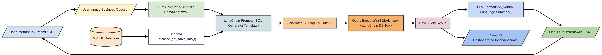

# 💬 LLM-Powered Business Query Assistant | Natural Language to SQL | Streamlit UI | LangChain

[](https://www.python.org/)
[](https://streamlit.io/)
[](https://www.langchain.com/)
[](https://www.mysql.com/)


## 🚀 Overview

This tool allows business teams and data analysts to query a MySQL database using natural language questions. Powered by LLMs and built with LangChain, the assistant converts user input to SQL, executes it, and returns both the raw result and a natural language explanation — all in a simple Streamlit interface.

### 🔑 Key Features

- 🔍 Convert plain English into precise SQL queries
- 🔁 Supports multiple LLM backends: `Gemini`, `Llama3`, `Mixtral`
- 🔗 Live MySQL database integration
- 📊 Streamlit GUI with easy credential input
- 🧠 Result-to-Insight natural language generation
- ⚙️ Built with LangChain pipelines

---

## 🛠️ Tech Stack

- **Python** – Core language
- **LangChain** – Orchestrates LLMs + schema + prompts
- **Google Gemini / Groq / Ollama** – LLMs for SQL and explanation generation
- **MySQL** – Database backend
- **Streamlit** – User-facing frontend
- **Vanna.ai (Optional)** – SQL suggestion layer

---



---

## 🧪 Installation

1. **Clone the repo**  
   ```bash
   git clone https://github.com/adrija26sg/hantavirus-database.git
   cd hantavirus-database
